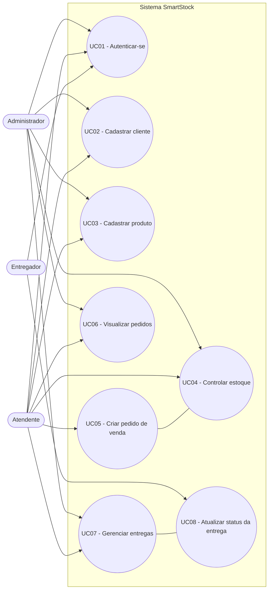
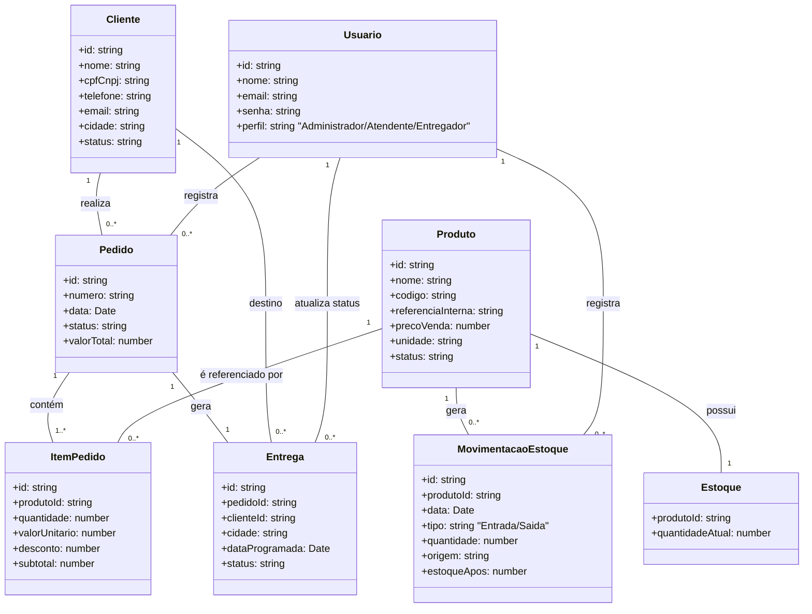
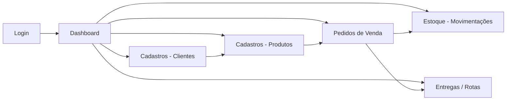

## Visão geral do sistema

O **SmartStock** é um sistema web estilo **mini-ERP** focado em:

- **Cadastros básicos**: clientes e produtos.
- **Pedidos de venda**: criação e acompanhamento dos pedidos.
- **Controle de estoque**: movimentações de entrada e saída atreladas aos pedidos e ajustes manuais.
- **Entregas / rotas**: organização simples das entregas originadas dos pedidos.

O objetivo é **simular um ERP real**, com uma arquitetura simples, 100% em frontend, mas com:

- Fluxos de negócio bem definidos.
- Persistência local (via `localStorage`) para manter os dados entre recargas.
- Navegação coerente que ajuda a contar uma “história” de uso em apresentação acadêmica.

---

## 1. Fluxo do processo de negócio (BPMN simplificado)

Diagrama em estilo BPMN (simplificado) representando o fluxo principal:

- Cliente faz um pedido.
- Sistema verifica disponibilidade em estoque.
- Pedido é confirmado e gera movimentações de estoque.
- Entrega é criada e acompanhada até a finalização.

```mermaid
flowchart LR
    A[Início] --> B[Cliente solicita criação de pedido]
    B --> C[Atendente cadastra/seleciona Cliente no sistema]
    C --> D[Atendente monta Pedido com Produtos e quantidades]
    D --> E[Sistema valida dados do Pedido]
    E -->|Dados inválidos| D
    E -->|Dados válidos| F[Sistema verifica estoque disponível]

    F -->|Sem estoque suficiente| G[Atendente ajusta itens, quantidades ou data]
    G --> D

    F -->|Estoque suficiente| H[Pedido é salvo como Orçamento/Pendente]
    H --> I[Sistema gera Movimentações de Estoque (Saída)]
    I --> J[Sistema cria registro de Entrega pendente]

    J --> K[Responsável de logística visualiza Entregas pendentes]
    K --> L[Entrega é atribuída a um Entregador/rota]
    L --> M[Entregador realiza a Entrega]

    M --> N[Entregador/Atendente atualiza status da Entrega para Entregue]
    N --> O[Status do Pedido atualizado para Entregue]
    O --> P[Fim]
```

Pontos importantes:

- A validação básica ocorre na criação do pedido.
- A baixa (saída) de estoque é vinculada ao pedido.
- A criação da entrega é automática quando o pedido é criado.
- O acompanhamento de status de entrega e pedido é parte do mesmo fluxo de negócio.

---

## 2. Diagrama de Casos de Uso

### 2.1. Atores

- **Administrador**
  - Usuário com visão geral do sistema, podendo gerenciar cadastros e acompanhar indicadores.
- **Atendente**
  - Responsável por cadastrar clientes, registrar pedidos e consultar estoque.
- **Entregador**
  - Acessa o módulo de entregas para ver sua rota e atualizar o status das entregas.

### 2.2. Casos de uso principais

- Cadastrar cliente.
- Cadastrar produto.
- Controlar estoque (entradas/saídas).
- Criar pedido de venda.
- Visualizar / listar pedidos.
- Gerenciar entregas (listar, alterar status).
- Atualizar status da entrega.
- Autenticar-se no sistema (login simples).

### 2.3. Diagrama (mermaid)



Observações:

- O mesmo módulo de login é utilizado por todos os atores.
- A criação de pedido naturalmente se relaciona ao controle de estoque e às entregas.
- O Administrador tem visão mais ampla, o Atendente foca na operação diária, e o Entregador atua sobre o módulo de entregas.

---

## 3. Diagrama de Classes

### 3.1. Principais classes

- `Cliente`
- `Produto`
- `Pedido`
- `ItemPedido`
- `Estoque` (conceito associado ao Produto + quantidade)
- `MovimentacaoEstoque`
- `Entrega`
- `Usuario`

### 3.2. Diagrama de classes (mermaid)



Observações de modelagem:

- `Estoque` é representado como estado atual da quantidade de um `Produto`.
- `MovimentacaoEstoque` guarda o histórico das mudanças de quantidade.
- `Pedido` agrega `ItemPedido`, e sua criação gera tanto movimentações de estoque quanto uma `Entrega`.
- `Usuario` abstrai perfis distintos (Administrador, Atendente, Entregador) via atributo `perfil`.

---

## 4. Fluxo geral de navegação do sistema

Fluxo simplificado da experiência do usuário:



### Passo a passo narrativo

1. **Login**
   - O usuário acessa a tela de login.
   - Após informar credenciais (login fake), entra no sistema.

2. **Dashboard**
   - Visualiza cards com indicadores: quantidade de pedidos, estoque, faturamento, etc.
   - Usa o menu lateral para navegar entre módulos.

3. **Clientes**
   - Acessa `Cadastros → Clientes`.
   - Consulta a lista de clientes e usa o formulário rápido para cadastrar novos clientes.

4. **Produtos**
   - Acessa `Cadastros → Produtos`.
   - Visualiza a lista de produtos, estoque e preço de venda.
   - Cadastra novos produtos informando código, referência, estoque inicial e preço.

5. **Pedidos**
   - Acessa `Vendas → Pedidos`.
   - Cria novo pedido/orçamento selecionando cliente e adicionando produtos.
   - O sistema calcula os totais, atualiza o estoque (saídas) e gera a entrega automaticamente.
   - Pode visualizar os pedidos existentes e atualizar seu status (Orçamento, Pendente, Faturado, Entregue, Cancelado).

6. **Estoque**
   - Acessa `Estoque → Movimentações`.
   - Visualiza o resumo de itens em estoque.
   - Lança entradas ou saídas manuais (por exemplo, acertos de inventário ou entradas por nota fiscal).

7. **Entregas**
   - Acessa o módulo de **Entregas / Rotas**.
   - Visualiza a fila de entregas pendentes, em rota e concluídas.
   - Atualiza o status das entregas (Pendente, Em rota, Entregue, Cancelada), refletindo o avanço do processo logístico.

---

## 5. Funcionamento geral (resumo)

- O sistema segue o fluxo natural de um mini-ERP:
  - Cadastrar **clientes** e **produtos**.
  - Criar **pedidos** associando clientes e produtos.
  - Gerar e controlar **estoque** através de movimentações.
  - Organizar **entregas** originadas dos pedidos e acompanhar seus status.
- A modelagem proposta (processo, casos de uso, classes e navegação) foi pensada para:
  - Ser **simples o suficiente** para uma apresentação de faculdade.
  - Ao mesmo tempo, representar **conceitos reais de sistemas de gestão** utilizados no mercado.

